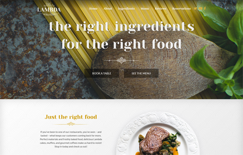

# Вёрстка макета Lambda restaurant
### [Собранная версия для просмотра](http://alexandervaliullin.github.io/lambda-restaurant-template/)

## Используемые библиотеки:
* [Animate.css](https://github.com/daneden/animate.css/)
* [Bootstrap](https://github.com/twbs/bootstrap/tree/v4-dev)
* [Font Awesome](https://github.com/FortAwesome/Font-Awesome)
* [jQuery](https://github.com/jquery/jquery)
* [Owl Carousel 2](https://github.com/OwlCarousel2/OwlCarousel2)

## Лицензия:
* Лицензия на вёрстку и код – [MIT](./LICENSE.md)
* Лицензия на макет и изображения – уточняйте на [Oxygenna.com](https://www.oxygenna.com/freebies/free-one-page-psd-template)
